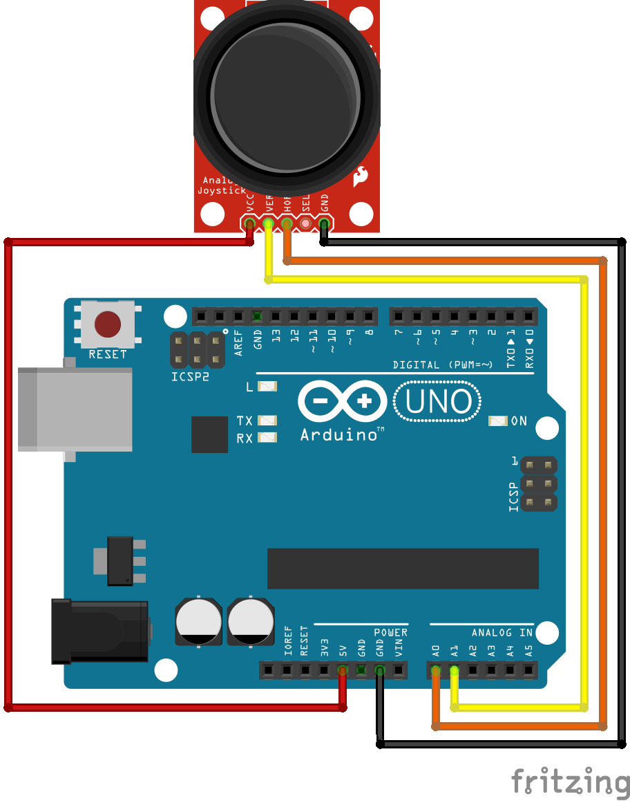

# Arduino Joystick
a simple project (for now) that will allow you to control a game within a web browser.

## dependancies
* MongoDB
* pySerial
* PyMongo
* ArduinoJson

## schematics (at the moment)
chances are this is going to change a lot as time goes on

